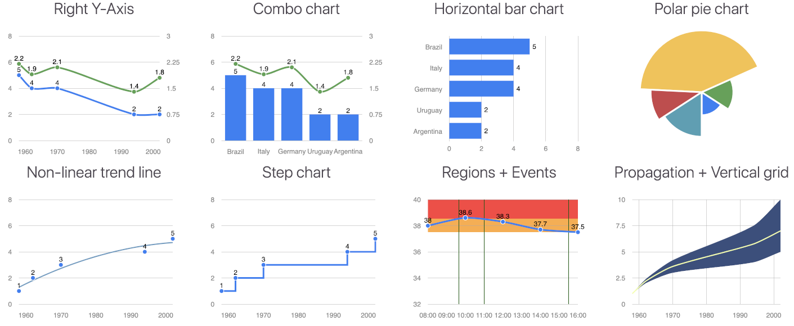

# simple-svg-charts.js - pretty time-series line graphs

This library provides a very simple API for drawing line, bar, area and donut charts in JS. It is based up on [morris.js06](https://github.com/pierresh/morris.js) which is based on the original [morris.js](https://github.com/morrisjs/morris.js). The original version was written in CoffeeScript and compiled to JavaScript. Because the original scripts used a very old
CoffeeScript syntax, which I didn't understand, I switched to develop the generated JavaScript. So I renamed the project from the original morris.js to simple-svg-charts.js to be more generic.

This library makes heavy use of [Raphael.js](https://github.com/DmitryBaranovskiy/raphael), which is a library for javascript based SVG object rendering. So, the simple-svg-charts library is much lightweight. 

Because of the small footprint the library can be used by newer and older browser. The browser only needs a useful SVG implementation. There is no JQuery or other dependency necessary.

# HowTo

To use this library, you need this 3 lines in your HTML file.

```
<html>
 <head>
  ...
   <link rel='stylesheet' href='simple-svg-charts.css'>
  ...
 </head>
 <body>
  ...
  <script src='raphael.min.js'></script>
  <script src='simple-svg-charts.js'></script>
 </body>
</html>
```

Now you need to define a HTML container, which is used to create the SVG chart, like

```
  ...
  <div id="example"></div>
  ...
```

Then, you need to define the chart itself


```
  ...
  <script>
    Morris.Line({
      element: 'example',
      data: [
        {year: '1958', nb: 1},
        {year: '1962', nb: 2},
        {year: '1970', nb: 3},
        {year: '1994', nb: 4},
        {year: '2002', nb: 5},
      ],
      xkey: 'year',
      ykeys: ['nb'],
      labels: ['Editions Wins']
    });
  </script>
  ...
```

Thats it. There are a lot of properties and options available. More can be found here.

# Examples




# Installation

You can either download the latest version of simple-svg-charts.js here from the [GitHub releases](https://github.com/trickert76/simple-svg-charts.js/releases/latest).

Or as an alternative install it via npm:

```bash
npm install simple-svg-charts.js
```

# Requirements

- [Raphael.js](http://raphaeljs.com/) (>= 2.3)
- [Regression.js](https://github.com/Tom-Alexander/regression-js/releases/tag/1.4.0) (1.4.0) for trendline type polynomial, logarithmic, exponential


# Changelog

## 1.0.0 (July 2025)
- renamed morris.js to simple-svg-charts.js
- removed coffeescript files

## 0.6.9 (3rd July 2021)
- Polar pie chart

## 0.6.7 & 0.6.8 (21st February 2021)
- npm import (ES6 Module) [Issue #4](https://github.com/pierresh/morris.js/issues/4)
- TypeScript type definitions

## 0.6.6 (12th May 2020)
- Escaping of labels refactored [Issue #15](https://github.com/pierresh/morris.js/issues/15)

## 0.6.5 (4th May 2020)
- option to display percentage in donut [Issue #12](https://github.com/pierresh/morris.js/issues/12)
- options pointSize and lineWidth for line curves in combo charts
- Display Pie\Donut value when there is only 1 value
- Escape labels in hover [Pull #464](https://github.com/morrisjs/morris.js/pull/464)
- option gridIntegers [Issue #344](https://github.com/morrisjs/morris.js/pull/344)
- Add lineType vertical for line charts [Issue #634](https://github.com/morrisjs/morris.js/issues/634)

## 0.6.4 (19th July 2019)
- display segments in pie charts even if total = 0 [Issue #13](https://github.com/pierresh/morris.js/issues/13)
- can add padding to pie charts [Issue #9](https://github.com/pierresh/morris.js/issues/9)
- options extraClassLine and extraClassCircle for line charts [Issue #7](https://github.com/pierresh/morris.js/pull/7)
- option to display customized text when pie chart has no data [Issue #705](https://github.com/morrisjs/morris.js/issues/705)

## 0.6.3 (16th September 2018)
- PostUnits and preUnits for pie chart added
- Method to destroy [Issue #569](https://github.com/morrisjs/morris.js/issues/569)
- Ymin2 and Ymax2 are now considered [Issue #5](https://github.com/pierresh/morris.js/issues/5)

## 0.6.2 (13th March 2018)
- Color data labels is defined automatically (black or white) according to color of element
- Can display colored regions [Issue #723](https://github.com/morrisjs/morris.js/issues/723)
- Add option pointSuperimposed [Issue #3](https://github.com/pierresh/morris.js/issues/3)
- Vertical grid can be dashed / dotted / …
- Animation of area chart improved
- Many other minor improvements

## 0.6.1 (13th February 2018)
- Step line added, based on [PR #331](https://github.com/morrisjs/morris.js/pull/331)
- Trend line can be non-linear (polynomial, logarithmic, exponential)
- Goals options for the right Y-axis [Issue #1](https://github.com/pierresh/morris.js/issues/1)
- Many other minor improvements

## 0.6.0 (8th January 2018)

- Combo Charts - Bar and Line together
- Right Y-axis [Issue #113](https://github.com/morrisjs/morris.js/issues/113)
- Pie chart type added
- Remove jQuery dependencies, based on [PR #503](https://github.com/morrisjs/morris.js/pull/503)
- Animation for every chart, based on [PR #62](https://github.com/morrisjs/morris.js/pull/62) for line chart and [PR #559](https://github.com/morrisjs/morris.js/pull/559) and for bar chart
- Labels for every chart, based on [PR #688](https://github.com/morrisjs/morris.js/pull/688)
- Orders of label in hover [Issue #534](https://github.com/morrisjs/morris.js/issues/534)
- Remove null values from computation of trend line
- Show a bar for value zero in a Bar charts  [Issue #744](https://github.com/morrisjs/morris.js/issues/744)
- Color scheme changed to Bootstrap 4's default theme
- Option to display percentage in Donut and Pie charts

## 0.5.1 - 15th June 2014

- Fix touch event handling.
- Fix stacked=false in bar chart [#275](https://github.com/morrisjs/morris.js/issues/275)
- Configurable vertical segments [#297](https://github.com/morrisjs/morris.js/issues/297)
- Deprecate continuousLine option.

## 0.5.0 - 19th March 2014

- Update grunt dependency [#288](https://github.com/morrisjs/morris.js/issues/228)
- Donut segment color config in data objects [#281](https://github.com/morrisjs/morris.js/issues/281)
- Customisable line widths and point drawing [#272](https://github.com/morrisjs/morris.js/issues/272)
- Bugfix for @options.smooth [#266](https://github.com/morrisjs/morris.js/issues/266)
- Option to disable axes individually [#253](https://github.com/morrisjs/morris.js/issues/253)
- Range selection [#252](https://github.com/morrisjs/morris.js/issues/252)
- Week format for x-labels [#250](https://github.com/morrisjs/morris.js/issues/250)
- Update developer quickstart instructions [#243](https://github.com/morrisjs/morris.js/issues/243)
- Experimenting with perceptual diffs.
- Add original data row to hover callback [#264](https://github.com/morrisjs/morris.js/issues/264)
- setData method for donut charts [#211](https://github.com/morrisjs/morris.js/issues/211)
- Automatic resizing [#111](https://github.com/morrisjs/morris.js/issues/111)
- Fix travis builds [#298](https://github.com/morrisjs/morris.js/issues/298)
- Option for rounded corners on bar charts [#305](https://github.com/morrisjs/morris.js/issues/305)
- Option to set padding for X axis labels [#306](https://github.com/morrisjs/morris.js/issues/306)
- Use local javascript for examples.
- Events on non-time series [#314](https://github.com/morrisjs/morris.js/issues/314)

## 0.4.3 - 12th May 2013

- Fix flickering hover box [#186](https://github.com/morrisjs/morris.js/issues/186)
- xLabelAngle option (diagonal labels!!) [#239](https://github.com/morrisjs/morris.js/issues/239)
- Fix area chart fill bug [#190](https://github.com/morrisjs/morris.js/issues/190)
- Make event handlers chainable
- gridTextFamily and gridTextWeight options
- Fix hovers with setData [#213](https://github.com/morrisjs/morris.js/issues/213)
- Fix hideHover behaviour [#236](https://github.com/morrisjs/morris.js/issues/236)

## 0.4.2 - 14th April 2013

- Fix DST handling [#191](https://github.com/morrisjs/morris.js/issues/191)
- Parse data values from strings in Morris.Donut [#189](https://github.com/morrisjs/morris.js/issues/189)
- Non-cumulative area charts [#199](https://github.com/morrisjs/morris.js/issues/199)
- Round Y-axis labels to significant numbers [#162](https://github.com/morrisjs/morris.js/issues/162)
- Customising default hover content [#179](https://github.com/morrisjs/morris.js/issues/179)

## 0.4.1 - 8th February 2013

- Fix goal and event rendering. [#181](https://github.com/morrisjs/morris.js/issues/181)
- Don't break when empty data is passed to setData [#142](https://github.com/morrisjs/morris.js/issues/142)
- labelColor option for donuts [#159](https://github.com/morrisjs/morris.js/issues/159)

## 0.4.0 - 26th January 2013

- Goals and events [#103](https://github.com/morrisjs/morris.js/issues/103).
- Bower package manager metadata.
- More flexible formatters [#107](https://github.com/morrisjs/morris.js/issues/107).
- Color callbacks.
- Decade intervals for time-axis labels.
- Non-continous line tweaks [#116](https://github.com/morrisjs/morris.js/issues/116).
- Stacked bars [#120](https://github.com/morrisjs/morris.js/issues/120).
- HTML hover [#134](https://github.com/morrisjs/morris.js/issues/134).
- yLabelFormat [#139](https://github.com/morrisjs/morris.js/issues/139).
- Disable axes [#114](https://github.com/morrisjs/morris.js/issues/114).

## 0.3.3 - 1st November 2012

- **Bar charts!** [#101](https://github.com/morrisjs/morris.js/issues/101).

## 0.3.2 - 28th October 2012

- **Area charts!** [#47](https://github.com/morrisjs/morris.js/issues/47).
- Some major refactoring and test suite improvements.
- Set smooth parameter per series [#91](https://github.com/morrisjs/morris.js/issues/91).
- Custom dateFormat for string x-values [#90](https://github.com/morrisjs/morris.js/issues/90).

## 0.3.1 - 13th October 2012

- Add `formatter` option for customising value labels in donuts [#75](https://github.com/morrisjs/morris.js/issues/75).
- Cycle `lineColors` on line charts to avoid running out of colours [#78](https://github.com/morrisjs/morris.js/issues/78).
- Add method to select donut segments. [#79](https://github.com/morrisjs/morris.js/issues/79).
- Don't go negative on yMin when all y values are zero. [#80](https://github.com/morrisjs/morris.js/issues/80).
- Don't sort data when parseTime is false [#83](https://github.com/morrisjs/morris.js/issues/83).
- Customise styling for points. [#87](https://github.com/morrisjs/morris.js/issues/87).

## 0.3.0 - 15th September 2012

- Donut charts!
- Bugfix: ymin/ymax bug [#71](https://github.com/morrisjs/morris.js/issues/71).
- Bugfix: infinite loop when data indicates horizontal line [#66](https://github.com/morrisjs/morris.js/issues/66).

## 0.2.10 - 26th June 2012

- Support for decimal labels on y-axis [#58](https://github.com/morrisjs/morris.js/issues/58).
- Better axis label clipping [#63](https://github.com/morrisjs/morris.js/issues/63).
- Redraw graphs with updated data using `setData` method [#64](https://github.com/morrisjs/morris.js/issues/64).
- Bugfix: series with zero or one non-null values [#65](https://github.com/morrisjs/morris.js/issues/65).

## 0.2.9 - 15th May 2012

- Bugfix: Fix zero-value regression
- Bugfix: Don't modify user-supplied data

## 0.2.8 - 10th May 2012

- Customising x-axis labels with `xLabelFormat` option
- Only use timezones when timezone info is specified
- Fix old IE bugs (mostly in examples!)
- Added `preunits` and `postunits` options
- Better non-continuous series data support

## 0.2.7 - 2nd April 2012

- Added `xLabels` option
- Refactored x-axis labelling
- Better ISO date support
- Fix bug with single value in non time-series graphs

## 0.2.6 - 18th March 2012

- Partial series support (see `null` y-values in `examples/quarters.html`)
- `parseTime` option bugfix for non-time-series data

## 0.2.5 - 15th March 2012

- Raw millisecond timestamp support (with `dateFormat` option)
- YYYY-MM-DD HH:MM[:SS[.SSS]] date support
- Decimal number labels

## 0.2.4 - 8th March 2012

- Negative y-values support
- `ymin` option
- `units` options

## 0.2.3 - 6th Mar 2012

- jQuery no-conflict compatibility
- Support ISO week-number dates
- Optionally hide hover on mouseout (`hideHover`)
- Optionally skip parsing dates, treating X values as an equally-spaced series (`parseTime`)

## 0.2.2 - 29th Feb 2012

- Bugfix: mouseover error when options.data.length == 2
- Automatically sort options.data

## 0.2.1 - 28th Feb 2012

- Accept a DOM element *or* an ID in `options.element`
- Add `smooth` option
- Bugfix: clone `@default`
- Add `ymax` option


## License

Copyright (c) 2012-2014, Olly Smith
All rights reserved.

Redistribution and use in source and binary forms, with or without
modification, are permitted provided that the following conditions are met:

1. Redistributions of source code must retain the above copyright notice, this
   list of conditions and the following disclaimer.
2. Redistributions in binary form must reproduce the above copyright notice,
   this list of conditions and the following disclaimer in the documentation
   and/or other materials provided with the distribution.

THIS SOFTWARE IS PROVIDED BY THE COPYRIGHT HOLDERS AND CONTRIBUTORS "AS IS" AND
ANY EXPRESS OR IMPLIED WARRANTIES, INCLUDING, BUT NOT LIMITED TO, THE IMPLIED
WARRANTIES OF MERCHANTABILITY AND FITNESS FOR A PARTICULAR PURPOSE ARE
DISCLAIMED. IN NO EVENT SHALL THE COPYRIGHT OWNER OR CONTRIBUTORS BE LIABLE FOR
ANY DIRECT, INDIRECT, INCIDENTAL, SPECIAL, EXEMPLARY, OR CONSEQUENTIAL DAMAGES
(INCLUDING, BUT NOT LIMITED TO, PROCUREMENT OF SUBSTITUTE GOODS OR SERVICES;
LOSS OF USE, DATA, OR PROFITS; OR BUSINESS INTERRUPTION) HOWEVER CAUSED AND
ON ANY THEORY OF LIABILITY, WHETHER IN CONTRACT, STRICT LIABILITY, OR TORT
(INCLUDING NEGLIGENCE OR OTHERWISE) ARISING IN ANY WAY OUT OF THE USE OF THIS
SOFTWARE, EVEN IF ADVISED OF THE POSSIBILITY OF SUCH DAMAGE.
